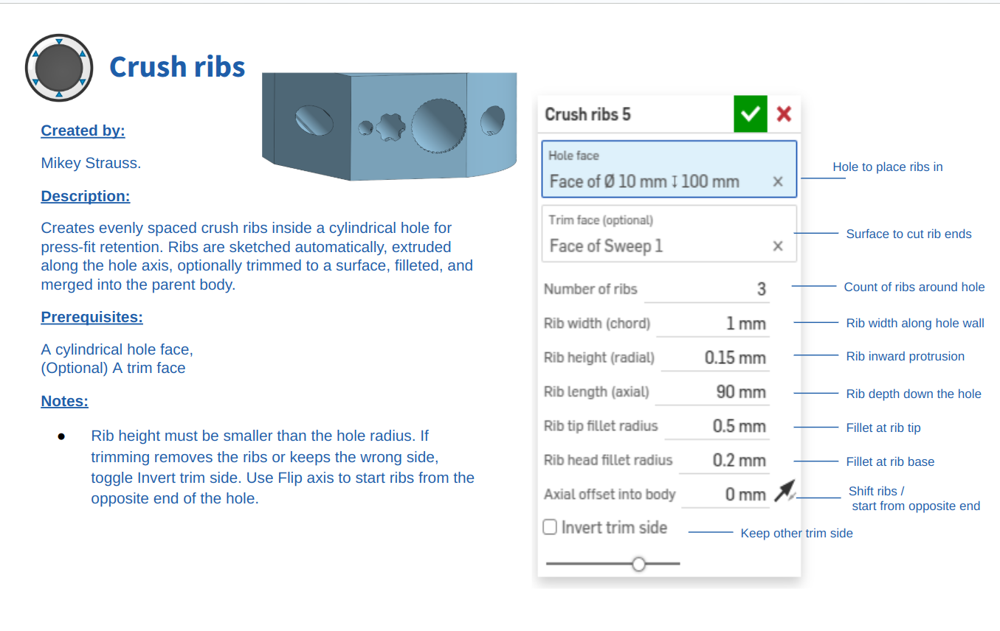

<h1 align="center">
  
   
  Crush Ribs – Onshape FeatureScript
</h1>

Add **crush ribs** to cylindrical holes in a single clean, parametric feature — ideal for 3D-printed **press fits**, **snap-in pegs**, and **precision friction-fit retention**.
This FeatureScript creates **wedge-shaped ribs inside a hole**, optionally trims them to curved/angled entry surfaces, applies fillets to ease insertion, and merges everything back neatly into the parent body.

> [On shape Feature Page](https://cad.onshape.com/documents/a56c3d3ab30e50b63edbfa0d/w/9ba07b3b785517f03a5ddc6f/e/360d7a163ea7a5db43e686ca?renderMode=0&uiState=6924b176be870b056f448862)

 

---

## ✨ Features

* 🕳️ **Works on any cylindrical hole**
* 🦷 **Configurable rib geometry**

  * Count (1–100)
  * Tangential width
  * Radial height
  * Axial length
  * Optional axial offset
* ✂️ **Trim ribs to a chosen face**

  * Use planar, angled, curved, or counterbored faces
* 🎯 **Automatic geometry detection**

  * Local coordinate system aligned to hole axis
  * Correct wedge-shaped sketching
* 🧵 **Two fillet zones**

  * *Rib tip fillet* (inner edges)
  * *Rib head fillet* (entry ring)
* 🔁 **Flip and invert controls**

  * Flip rib direction depending on which side of the cylinder is selected
  * Invert trimming side to keep the right halves

---

## 📸 Examples

> Replace with your real screenshots once generated.

* Basic 5-rib configuration
* Trimmed ribs matched to an angled chamfer
* Cross-section of rib geometry
* Rib head fillets for easier insertion

---

## 🚀 Using the Feature

1. Activate **Crush ribs** from your feature toolbar.
2. Select the **cylindrical hole face**.
3. (Optional) Select a **Trim face** to shape the rib ends.
4. Adjust parameters:

   * Rib count
   * Rib width
   * Rib height (radial intrusion)
   * Rib length (axial)
   * Fillets
5. Toggle:

   * **Flip along axis** (choose which side is entry)
   * **Invert trim side** (if ribs vanish or outside chunk remains)
6. Click ✓
   The feature:

   * Sketches rib profiles
   * Extrudes them as NEW bodies
   * Splits (optional)
   * Fillets
   * Unions ribs into the part
   * Cleans up sketch bodies

---

## ⚙️ Parameter Reference

| Parameter                  | Description                                          |
| -------------------------- | ---------------------------------------------------- |
| **Hole face**              | Cylindrical surface to place ribs inside.            |
| **Trim face**              | Optional planar/curved face for trimming rib length. |
| **Number of ribs**         | Total ribs radially (default 5).                     |
| **Rib width**              | Tangential chord width at the wall.                  |
| **Rib height**             | Radial intrusion depth.                              |
| **Rib length**             | Axial extrusion distance before trimming.            |
| **Rib tip fillet radius**  | Fillets along inner rib edges at the deepest point.  |
| **Rib head fillet radius** | Fillets at the entry ring of each rib.               |
| **Axial offset**           | Moves rib start deeper inside the hole.              |
| **Flip along axis**        | Switches entry side.                                 |
| **Invert trim side**       | Fixes wrong trim half.                               |

---

## 🧱 Advanced Notes (Implementation)

* Uses `evAxis` and `evSurfaceDefinition` to extract cylinder geometry.
* Automatically constructs a local CSYS aligned to the hole axis.
* Computes tangential wedge angle from rib width & hole radius.
* Splitting uses:

  * `opSplitPart`
  * `qSplitBy` for BACK/FRONT halves.
* Fillet targeting is entirely geometric:

  * Detects rib tip edges via radial-distance thresholds.
  * Detects rib head faces by axis coordinate delta.
  * Clusters edges via `qAdjacent` to avoid kernel failures.
* All ribs are ultimately merged via a single `opBoolean`.

---

## 🧵 3D Printing Tips

* **Press-fit ideal rib height:** 0.15–0.35 mm
* **Use ribs instead of shrinking holes:**
  Better print quality, keeps hole dimension predictable.
* **Fillets:**

  * Tip fillet: 0.1–0.3 mm
  * Head fillet: 0.05–0.2 mm
    Small fillets greatly improve ease of insertion.

---

## 🤝 Contributing

Pull requests welcome!

Ideas:

* Automatic rib taper
* Alternating rib heights
* Dual-zone grip profiles
* Integration with Hole feature sketches
* Presets for common printer/nozzle setups

---

## 📄 License — Apache 2.0

This project is licensed under the **Apache License 2.0**.
See [`LICENSE`](LICENSE) in the repository.

